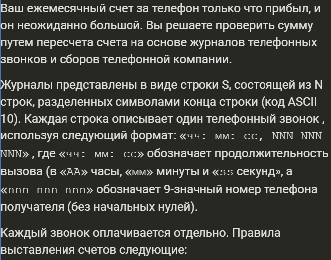

# php-calculating-cost-of-calls
Расчет стоимость телефонных звонков на основе журнала по условиям оператора связи. / Calculation of the cost of phone calls based on the log according to the terms of the operator.

Задача сделана за 60 минут.

Журнал звонков такого вида: 

$str = "

00: 02: 45,400-234-344

00: 02: 15,400-234-344

00: 00: 10,400-234-344

00: 00: 10,400-234-344

00: 01: 55,400-234-324

00: 02: 15,400-234-344

00: 02: 45,400-234-314

00: 02: 35,400-234-314

00: 01: 55,400-234-324

00: 02: 15,400-234-314";

+ дополнительные акции оператора

Дополнительные условия задачи читайте в jpg 1-4

